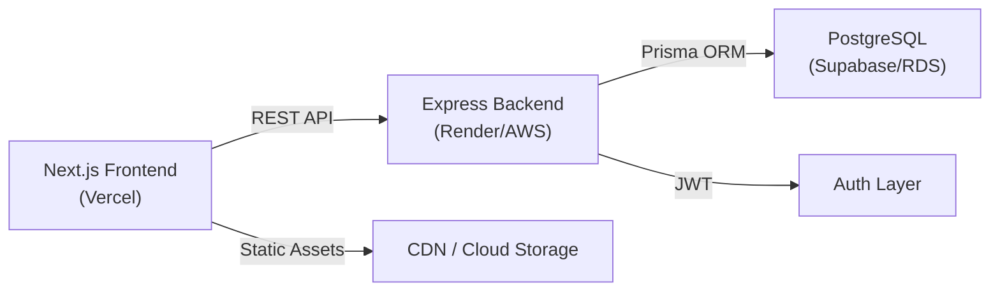
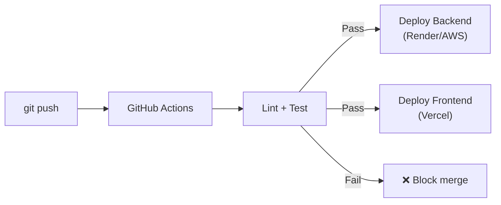

# 🗺️ RENT-ISH — Master Roadmap

> **Project:** Rent-ish (Fashion Rental Platform)  
> **Role:** Sole Full-Stack Developer  
> **Stack:** Node.js/Express · Next.js App Router · Tailwind · PostgreSQL · Prisma 7  
> **Current State:** Scaffolding ✅ | DB Schema ✅ | GiST Constraint ✅  

---

## Overview — Kiến Trúc Tổng Quan



### Phương Pháp: Vertical Slicing

Thay vì xây toàn bộ Backend rồi mới làm Frontend (Horizontal), ta sẽ dùng **Vertical Slicing** — xây dựng **từng tính năng hoàn chỉnh từ DB → API → UI** trước khi chuyển sang tính năng tiếp theo. Điều này giúp:
- Demo được cho client sớm nhất có thể
- Phát hiện lỗi tích hợp ngay từ đầu
- Duy trì động lực phát triển

---

## Phase 1: API Foundation & Seeding
> **Mục tiêu:** Xây dựng nền móng Backend vững chắc, có dữ liệu mẫu để test

### Step 1.1 — Kiến Trúc Thư Mục Backend

Tạo cấu trúc thư mục chuẩn **Controller → Service → Prisma** pattern:

```
backend/src/
├── index.ts                    # Entry point
├── app.ts                      # Express config (middleware, routes)
├── config/
│   └── prisma.ts               # PrismaClient singleton
├── routes/
│   ├── index.ts                # Gom tất cả routes
│   ├── product.routes.ts
│   └── booking.routes.ts
├── controllers/
│   ├── product.controller.ts
│   └── booking.controller.ts
├── services/
│   ├── product.service.ts
│   └── booking.service.ts
├── middlewares/
│   ├── error.middleware.ts     # Global error handler
│   └── validate.middleware.ts  # Request validation
├── utils/
│   └── ApiError.ts             # Custom error class
└── types/
    └── index.ts                # Shared TypeScript types
```

| Task | Chi tiết |
|------|----------|
| 1.1.1 | Tạo cấu trúc thư mục và các file trống |
| 1.1.2 | Viết `config/prisma.ts` — PrismaClient singleton |
| 1.1.3 | Viết `utils/ApiError.ts` — Custom error class |
| 1.1.4 | Viết `middlewares/error.middleware.ts` — Global error handler |
| 1.1.5 | Refactor `app.ts` — Tách cấu hình Express ra khỏi `index.ts` |

**Best Practices:**
- PrismaClient phải là **singleton** (chỉ tạo 1 instance duy nhất) để tránh tràn kết nối DB
- Mọi lỗi đều phải đi qua Global Error Handler — không bao giờ để server crash

---

### Step 1.2 — Product API (CRUD)

| Task | Method | Endpoint | Chi tiết |
|------|--------|----------|----------|
| 1.2.1 | `GET` | `/api/products` | Lấy danh sách sản phẩm (có phân trang, filter) |
| 1.2.2 | `GET` | `/api/products/:id` | Lấy chi tiết 1 sản phẩm (kèm variants & inventory) |
| 1.2.3 | `POST` | `/api/products` | Tạo sản phẩm mới (Admin) |
| 1.2.4 | `PUT` | `/api/products/:id` | Cập nhật sản phẩm (Admin) |
| 1.2.5 | `DELETE` | `/api/products/:id` | Xóa mềm sản phẩm (Admin) |

**Best Practices:**
- Dùng `select` hoặc `include` trong Prisma query để chỉ lấy đúng dữ liệu cần thiết
- Implement phân trang (pagination) ngay từ đầu: `?page=1&limit=12`
- Response format chuẩn: `{ success: true, data: {...}, pagination: {...} }`

---

### Step 1.3 — Booking API

| Task | Method | Endpoint | Chi tiết |
|------|--------|----------|----------|
| 1.3.1 | `POST` | `/api/bookings` | Tạo đơn đặt thuê mới (với daterange) |
| 1.3.2 | `GET` | `/api/bookings/:id` | Lấy chi tiết 1 đơn đặt |
| 1.3.3 | `PATCH` | `/api/bookings/:id/status` | Cập nhật trạng thái đơn |
| 1.3.4 | `GET` | `/api/products/:id/availability` | Kiểm tra tình trạng sản phẩm theo khoảng ngày |

**Best Practices:**
- Booking creation phải dùng **Prisma Transaction** (`$transaction`) để đảm bảo tính nhất quán
- Khi tạo BookingItem, dùng `$queryRaw` để insert `daterange` vì Prisma không hỗ trợ native
- API availability phải query trực tiếp GiST index để kiểm tra xung đột

---

### Step 1.4 — Database Seeding

| Task | Chi tiết |
|------|----------|
| 1.4.1 | Viết file `prisma/seed.ts` với dữ liệu mẫu thực tế (5-10 sản phẩm thời trang) |
| 1.4.2 | Thêm script `"seed"` vào `package.json` |
| 1.4.3 | Chạy seed và xác minh dữ liệu trong pgAdmin |

---

## Phase 2: Core Feature Implementation (Frontend + Backend Vertical Slices)
> **Mục tiêu:** Xây dựng giao diện người dùng hoàn chỉnh, kết nối với API

### Step 2.1 — Frontend Foundation

| Task | Chi tiết |
|------|----------|
| 2.1.1 | Cấu hình Tailwind theme (màu sắc, font chữ, spacing) cho brand "Rent-ish" |
| 2.1.2 | Tạo Layout chính: Navbar, Footer, Container |
| 2.1.3 | Cài đặt và cấu hình API client (fetch wrapper hoặc axios) |
| 2.1.4 | Setup môi trường: `.env.local` với `NEXT_PUBLIC_API_URL` |

**Best Practices:**
- Dùng **Server Components** (mặc định trong App Router) cho các trang tĩnh
- Chỉ dùng `"use client"` khi cần interactivity (form, state, event handler)
- Tạo một `fetchApi()` wrapper tập trung để xử lý lỗi thống nhất

---

### Step 2.2 — Vertical Slice: Product Catalog

```
[DB: Product table] → [API: GET /products] → [UI: Catalog Page]
```

| Task | Tầng | Chi tiết |
|------|------|----------|
| 2.2.1 | Frontend | Trang `/` — Hero section + Product grid (Server Component) |
| 2.2.2 | Frontend | Component `ProductCard` — Hiển thị ảnh, tên, giá thuê |
| 2.2.3 | Frontend | Trang `/products/[id]` — Chi tiết sản phẩm (ảnh, size, màu) |
| 2.2.4 | Frontend | Component `VariantSelector` — Chọn size & color (Client Component) |
| 2.2.5 | Integration | Kết nối Frontend với Backend API, test end-to-end |

**Best Practices:**
- Product listing page dùng **Server Component** + `fetch()` trực tiếp từ server
- Image optimization bằng `next/image`
- Loading skeleton / Suspense boundary cho UX mượt mà

---

### Step 2.3 — Vertical Slice: Date-Picker Booking Flow

```
[UI: DatePicker] → [API: Check Availability] → [API: Create Booking] → [UI: Confirmation]
```

| Task | Tầng | Chi tiết |
|------|------|----------|
| 2.3.1 | Frontend | Component `DateRangePicker` — Chọn ngày thuê (Client Component) |
| 2.3.2 | Frontend | Hiển thị lịch với các ngày **đã bị đặt** (disabled/greyed out) |
| 2.3.3 | Integration | Gọi `GET /availability` để lấy ngày trống khi user chọn sản phẩm |
| 2.3.4 | Frontend | Component `BookingSummary` — Tóm tắt đơn (sản phẩm, ngày, giá) |
| 2.3.5 | Integration | Gọi `POST /bookings` khi user xác nhận đặt thuê |
| 2.3.6 | Frontend | Trang xác nhận đơn hàng thành công |

**Best Practices:**
- Sử dụng thư viện date-picker uy tín (ví dụ: `react-day-picker` hoặc `date-fns`)
- **Optimistic UI:** Hiển thị trạng thái "Đang xử lý" ngay khi user bấm đặt
- **Double validation:** Check availability ở cả Frontend (UX) VÀ Backend (bảo mật)

---

### Step 2.4 — Vertical Slice: Cart / Order Management

| Task | Tầng | Chi tiết |
|------|------|----------|
| 2.4.1 | Frontend | Component `Cart` — Quản lý giỏ hàng (Local State hoặc Zustand) |
| 2.4.2 | Frontend | Trang `/orders` — Lịch sử đơn đặt thuê |
| 2.4.3 | Frontend | Component `OrderStatusBadge` — Hiển thị trạng thái đơn hàng |
| 2.4.4 | Backend | API lấy danh sách booking theo user_id |

---

## Phase 3: Security, Authentication & Validation
> **Mục tiêu:** Bảo vệ API, xác thực người dùng, validate dữ liệu đầu vào

### Step 3.1 — Authentication System

| Task | Chi tiết |
|------|----------|
| 3.1.1 | Thêm model `User` vào `schema.prisma` (id, email, password_hash, role, created_at) |
| 3.1.2 | API `POST /api/auth/register` — Đăng ký (hash password bằng `bcrypt`) |
| 3.1.3 | API `POST /api/auth/login` — Đăng nhập (trả về JWT access token + refresh token) |
| 3.1.4 | Middleware `auth.middleware.ts` — Xác thực JWT token trên mọi protected route |
| 3.1.5 | Middleware `role.middleware.ts` — Phân quyền (CUSTOMER vs ADMIN) |
| 3.1.6 | Frontend: Trang Login/Register + lưu token an toàn (httpOnly cookie) |

**Best Practices:**
- **KHÔNG BAO GIỜ** lưu JWT trong localStorage (dễ bị XSS). Dùng `httpOnly` cookie
- Password hash bằng `bcrypt` với salt rounds >= 10
- Access token ngắn hạn (15 phút) + Refresh token dài hạn (7 ngày)

---

### Step 3.2 — Input Validation & Sanitization

| Task | Chi tiết |
|------|----------|
| 3.2.1 | Cài đặt `zod` (validation library) |
| 3.2.2 | Viết validation schemas cho tất cả API endpoints |
| 3.2.3 | Viết middleware `validate.middleware.ts` tích hợp Zod |
| 3.2.4 | Sanitize tất cả input để chống SQL Injection & XSS |

**Best Practices:**
- Validate **MỌI THỨ** đến từ client: body, params, query string
- Dùng Zod vì nó tích hợp tốt với TypeScript (type-safe validation)

---

### Step 3.3 — Security Hardening

| Task | Chi tiết |
|------|----------|
| 3.3.1 | Cài đặt `helmet` — Bảo vệ HTTP headers |
| 3.3.2 | Cấu hình `cors` — Chỉ cho phép Frontend origin |
| 3.3.3 | Cài đặt `express-rate-limit` — Chống brute-force & DDoS |
| 3.3.4 | Cấu hình HTTPS cho production |

---

## Phase 4: CI/CD Pipeline & Cloud Deployment
> **Mục tiêu:** Tự động hóa quy trình deploy, đưa ứng dụng lên cloud

### Step 4.1 — Testing

| Task | Loại test | Chi tiết |
|------|-----------|----------|
| 4.1.1 | Unit Test | Test các service functions (business logic) bằng `vitest` |
| 4.1.2 | Integration Test | Test API endpoints với database thật (test container) |
| 4.1.3 | E2E Test | Test luồng booking hoàn chỉnh từ UI đến DB |

---

### Step 4.2 — CI/CD Pipeline (GitHub Actions)

| Task | Chi tiết |
|------|----------|
| 4.2.1 | Tạo `.github/workflows/ci.yml` — Chạy lint + test tự động khi push |
| 4.2.2 | Tạo workflow tự động deploy Backend khi merge vào `main` |
| 4.2.3 | Cấu hình Vercel auto-deploy cho Frontend |



---

### Step 4.3 — Cloud Deployment

| Task | Platform | Chi tiết |
|------|----------|----------|
| 4.3.1 | **Vercel** | Deploy Next.js Frontend (miễn phí) |
| 4.3.2 | **Render** hoặc **Railway** | Deploy Express Backend |
| 4.3.3 | **Supabase** hoặc **Neon** | Migrate PostgreSQL lên cloud |
| 4.3.4 | Cấu hình | Environment variables, domain, SSL |

---

## Phase 5: Client Handover
> **Mục tiêu:** Bàn giao sản phẩm hoàn chỉnh cho client

### Step 5.1 — Documentation

| Task | Chi tiết |
|------|----------|
| 5.1.1 | **API Documentation** — Dùng Swagger/OpenAPI để tạo docs tương tác |
| 5.1.2 | **System Architecture** — Sơ đồ kiến trúc tổng quan (Mermaid diagram) |
| 5.1.3 | **Database Schema** — ERD diagram + giải thích từng bảng |
| 5.1.4 | **Deployment Guide** — Hướng dẫn deploy lại từ đầu nếu cần |

---

### Step 5.2 — Admin Panel & User Manual

| Task | Chi tiết |
|------|----------|
| 5.2.1 | Trang Admin Dashboard — Quản lý sản phẩm, đơn hàng, user |
| 5.2.2 | User Manual — Hướng dẫn sử dụng cho client (PDF/Notion) |
| 5.2.3 | Demo video — Quay video demo tất cả tính năng |

---

### Step 5.3 — Final QA & Handover

| Task | Chi tiết |
|------|----------|
| 5.3.1 | Smoke test toàn bộ tính năng trên môi trường production |
| 5.3.2 | Performance audit (Lighthouse score >= 90) |
| 5.3.3 | Security audit cuối cùng |
| 5.3.4 | Bàn giao source code, credentials, và tài liệu cho client |

---

## 📊 Timeline Ước Tính

| Phase | Thời gian | Trạng thái |
|-------|-----------|------------|
| Phase 1: API Foundation & Seeding | 1-2 tuần | 🔜 Sắp bắt đầu |
| Phase 2: Core Features (Catalog, Booking) | 2-3 tuần | ⏳ Chờ |
| Phase 3: Security & Auth | 1 tuần | ⏳ Chờ |
| Phase 4: CI/CD & Deployment | 3-5 ngày | ⏳ Chờ |
| Phase 5: Handover | 3-5 ngày | ⏳ Chờ |
| **Tổng cộng** | **~6-8 tuần** | |

---

## 🚀 Bắt Đầu

> [!IMPORTANT]
> Khi bạn đã sẵn sàng, hãy gõ **"READY"** để tôi hướng dẫn bạn viết code cho **Phase 1, Step 1.1** — Xây dựng kiến trúc thư mục Backend và các module nền tảng (PrismaClient singleton, Custom Error class, Global Error Handler).
