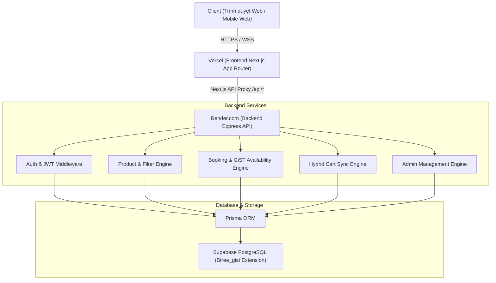
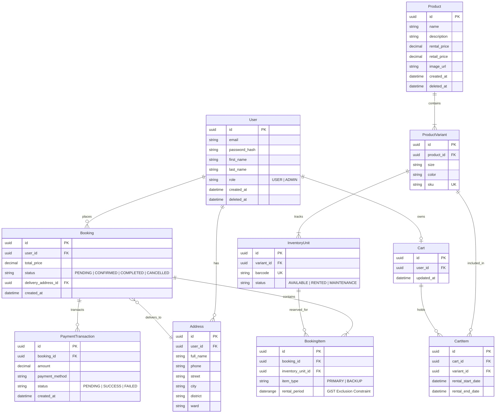

# Kiến Trúc Hệ Thống (Architecture & ERD) — Rent-ish

> **Dự án:** Rent-ish (Nền tảng thuê trang phục thiết kế cao cấp & thời trang tuần hoàn)  
> **Kiến trúc:** Monorepo (Next.js 15 App Router Frontend + Node/Express/Prisma Backend + Supabase PostgreSQL)

---

## 1. Sơ Đồ Kiến Trúc Tổng Quan (System Architecture)



---

## 2. Sơ Đồ Thực Thể Quan Hệ Cơ Sở Dữ Liệu (ERD Diagram)



---

## 3. Ba Trụ Cột Nghiệp Vụ Cốt Lõi (Core Business Mechanics)

### 3.1. Cơ Chế Chống Trùng Lịch Thuê (GiST Daterange Constraint)
- **Vấn đề của bài toán cho thuê:** Nếu 2 khách hàng cùng đặt 1 chiếc váy trong khoảng thời gian giao nhau (VD: Khách A thuê 01/10 - 05/10, Khách B thuê 03/10 - 07/10), nếu chỉ kiểm tra ở tầng code ứng dụng thì khi có 2 request đồng thời (race condition) sẽ gây ra **Double-Booking (bán trùng đồ)**.
- **Giải pháp của Rent-ish:**
  - Kích hoạt extension `btree_gist` trên PostgreSQL.
  - Thiết lập **Exclusion Constraint** trên bảng `BookingItem`:
    ```sql
    ALTER TABLE "BookingItem" 
    ADD CONSTRAINT "no_overlapping_rentals" 
    EXCLUDE USING gist (
      inventory_unit_id WITH =,
      rental_period WITH &&
    );
    ```
  - Khi có xung đột ngày thuê, PostgreSQL sẽ chặn ngay lập tức ở tầng hạt nhân cơ sở dữ liệu và quăng lỗi mã `conflicting key value`. Backend bắt lỗi này và thông báo thân thiện tới khách hàng: *"Đã có khách đặt trước trong khoảng thời gian này"*.

### 3.2. Giỏ Hàng Lai (Hybrid Cart Architecture - Giải Pháp B)
1. **Khách vãng lai (Guest):** Thêm đồ vào giỏ, chọn ngày và size. Dữ liệu được lưu trữ tức thì và bền vững trong trình duyệt qua **Zustand Persist Middleware** (`localStorage`).
2. **Khi Khách Đăng Nhập:**
   - Hệ thống tự động kích hoạt API `POST /api/cart/merge`.
   - Toàn bộ các món đồ từ `localStorage` được đồng bộ ngầm vào bảng `Cart` và `CartItem` trên cơ sở dữ liệu.
3. **Luồng Thanh Toán (Checkout):**
   - Áp dụng nguyên tắc chuẩn e-commerce cao cấp (Giải pháp B): Khách cần đăng nhập để xác thực danh tính người chịu trách nhiệm tài sản thuê.
   - Khi hoàn tất đặt thuê, giỏ hàng tự động được dọn sạch (`clearCart`).

### 3.3. Bảo Mật Đa Tầng (Enterprise Security)
- **JWT HttpOnly Cookies:** Access token (thời hạn 15 phút) và Refresh token (thời hạn 7 ngày) được lưu trữ an toàn trong `httpOnly` cookie (`SameSite: Lax`), miễn nhiễm hoàn toàn với các cuộc tấn công đánh cắp token qua XSS.
- **Role-Based Access Control (RBAC):** Middleware `authorize("ADMIN")` bảo vệ nghiêm ngặt các route quản trị (`/api/products` (POST/PUT/DELETE), `/api/users`, `/api/bookings/admin/all`).
- **Khóa an toàn tài khoản quản trị:** API quản lý tài khoản chặn thao tác tự hạ quyền quản trị viên của chính mình khi đang trong phiên làm việc.
- **HTTP Protection:** Helmet điều chỉnh security headers, Express Rate Limiter ngăn chặn tấn công từ chối dịch vụ (DDoS) và brute force mật khẩu.
